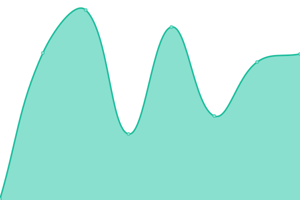

# [📈 Live Status](https://duyet.github.io/uptime): <!--live status--> **🟩 All systems operational**

This repository contains the open-source uptime monitor and status page for [Duyet Le](https://duyet.net), powered by [Upptime](https://github.com/upptime/upptime).

With [Upptime](https://upptime.js.org), you can get your own unlimited and free uptime monitor and status page, powered entirely by a GitHub repository. We use [Issues](https://github.com/duyet/uptime/issues) as incident reports, [Actions](https://github.com/duyet/uptime/actions) as uptime monitors, and [Pages](https://duyet.github.io/uptime) for the status page.

<!--start: status pages-->
<!-- This summary is generated by Upptime (https://github.com/upptime/upptime) -->
<!-- Do not edit this manually, your changes will be overwritten -->
<!-- prettier-ignore -->
| URL | Status | History | Response Time | Uptime |
| --- | ------ | ------- | ------------- | ------ |
|  [duyet.net](https://duyet.net) | 🟩 Up | [duyet-net.yml](https://github.com/duyet/uptime/commits/HEAD/history/duyet-net.yml) | 

 235ms
     
 | 

<a href="https://duyet.github.io/uptime/history/duyet-net">98.61%</a>
    

|  [blog.duyet.net](https://blog.duyet.net) | 🟩 Up | [blog-duyet-net.yml](https://github.com/duyet/uptime/commits/HEAD/history/blog-duyet-net.yml) | 

 100ms
     
 | 

<a href="https://duyet.github.io/uptime/history/blog-duyet-net">98.61%</a>
    

|  [s.duyet.net](https://s.duyet.net) | 🟩 Up | [s-duyet-net.yml](https://github.com/duyet/uptime/commits/HEAD/history/s-duyet-net.yml) | 

 100ms
     
 | 

<a href="https://duyet.github.io/uptime/history/s-duyet-net">100.00%</a>
    

|  [pricetrack](https://tracker.duyet.net) | 🟩 Up | [pricetrack.yml](https://github.com/duyet/uptime/commits/HEAD/history/pricetrack.yml) | 

 56ms
     
 | 

<a href="https://duyet.github.io/uptime/history/pricetrack">100.00%</a>
    

|  [cdn.duyet.net](https://cdn.duyet.net) | 🟩 Up | [cdn-duyet-net.yml](https://github.com/duyet/uptime/commits/HEAD/history/cdn-duyet-net.yml) | 

 126ms
     
 | 

<a href="https://duyet.github.io/uptime/history/cdn-duyet-net">98.61%</a>
    

|  [til.duyet.net](https://til.duyet.net) | 🟩 Up | [til-duyet-net.yml](https://github.com/duyet/uptime/commits/HEAD/history/til-duyet-net.yml) | 

 224ms
     
 | 

<a href="https://duyet.github.io/uptime/history/til-duyet-net">98.61%</a>
    

|  [Okie.one](https://okie.one) | 🟩 Up | [okie-one.yml](https://github.com/duyet/uptime/commits/HEAD/history/okie-one.yml) | 

 87ms
     
 | 

<a href="https://duyet.github.io/uptime/history/okie-one">100.00%</a>
    

|  [The Feedback](https://feedback.okie.one) | 🟩 Up | [the-feedback.yml](https://github.com/duyet/uptime/commits/HEAD/history/the-feedback.yml) | 

 123ms
     
 | 

<a href="https://duyet.github.io/uptime/history/the-feedback">100.00%</a>
    

|  [The Feedback Docs](https://feedback.okie.one/docs) | 🟩 Up | [the-feedback-docs.yml](https://github.com/duyet/uptime/commits/HEAD/history/the-feedback-docs.yml) | 

 95ms
     
 | 

<a href="https://duyet.github.io/uptime/history/the-feedback-docs">100.00%</a>
    

|  [Ngan.vn](https://cake.ngan.vn) | 🟩 Up | [ngan-vn.yml](https://github.com/duyet/uptime/commits/HEAD/history/ngan-vn.yml) | 

 2014ms
     
 | 

<a href="https://duyet.github.io/uptime/history/ngan-vn">99.53%</a>
    

|  [Very Nini](https://verynini.com) | 🟩 Up | [very-nini.yml](https://github.com/duyet/uptime/commits/HEAD/history/very-nini.yml) | 

 1868ms
     
 | 

<a href="https://duyet.github.io/uptime/history/very-nini">100.00%</a>
    

|  [hocdata.com](https://hocdata.com) | 🟩 Up | [hocdata-com.yml](https://github.com/duyet/uptime/commits/HEAD/history/hocdata-com.yml) | 

 171ms
     
 | 

<a href="https://duyet.github.io/uptime/history/hocdata-com">98.61%</a>
    

|  [uptime](https://duyet.github.io/uptime) | 🟩 Up | [uptime.yml](https://github.com/duyet/uptime/commits/HEAD/history/uptime.yml) | 

 91ms
     
 | 

<a href="https://duyet.github.io/uptime/history/uptime">100.00%</a>
    

|  [duyetdev.com](https://duyetdev.com) | 🟩 Up | [duyetdev-com.yml](https://github.com/duyet/uptime/commits/HEAD/history/duyetdev-com.yml) | 

 278ms
     
 | 

<a href="https://duyet.github.io/uptime/history/duyetdev-com">98.61%</a>
    

|  [next.ngan.vn](https://next.ngan.vn) | 🟩 Up | [next-ngan-vn.yml](https://github.com/duyet/uptime/commits/HEAD/history/next-ngan-vn.yml) | 

 88ms
     
 | 

<a href="https://duyet.github.io/uptime/history/next-ngan-vn">100.00%</a>
    

<!--end: status pages-->

[**Visit our status website →**](https://duyet.github.io/uptime)

## 📄 License

- Powered by: [Upptime](https://github.com/upptime/upptime)
- Code: [MIT](./LICENSE) © [Duyet Le](https://duyet.net)
- Data in the `./history` directory: [Open Database License](https://opendatacommons.org/licenses/odbl/1-0/)
