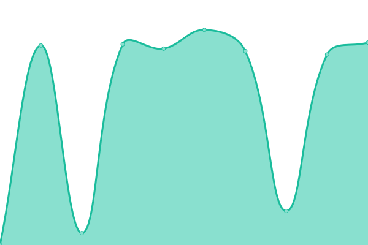

# [📈 Live Status](https://duyet.github.io/uptime): <!--live status--> **🟩 All systems operational**

This repository contains the open-source uptime monitor and status page for [Duyet Le](https://duyet.net), powered by [Upptime](https://github.com/upptime/upptime).

With [Upptime](https://upptime.js.org), you can get your own unlimited and free uptime monitor and status page, powered entirely by a GitHub repository. We use [Issues](https://github.com/duyet/uptime/issues) as incident reports, [Actions](https://github.com/duyet/uptime/actions) as uptime monitors, and [Pages](https://duyet.github.io/uptime) for the status page.

<!--start: status pages-->
<!-- This summary is generated by Upptime (https://github.com/upptime/upptime) -->
<!-- Do not edit this manually, your changes will be overwritten -->
<!-- prettier-ignore -->
| URL | Status | History | Response Time | Uptime |
| --- | ------ | ------- | ------------- | ------ |
|  [duyet.net](https://duyet.net) | 🟩 Up | [duyet-net.yml](https://github.com/duyet/uptime/commits/HEAD/history/duyet-net.yml) | 

 228ms
     
 | 

<a href="https://duyet.github.io/uptime/history/duyet-net">100.00%</a>
    

|  [Blog](https://blog.duyet.net) | 🟩 Up | [blog.yml](https://github.com/duyet/uptime/commits/HEAD/history/blog.yml) | 

 80ms
     
 | 

<a href="https://duyet.github.io/uptime/history/blog">100.00%</a>
    

|  [Shorten Link](https://s.duyet.net) | 🟩 Up | [shorten-link.yml](https://github.com/duyet/uptime/commits/HEAD/history/shorten-link.yml) | 

 842ms
     
 | 

<a href="https://duyet.github.io/uptime/history/shorten-link">100.00%</a>
    

|  [Okie.one](https://okie.one) | 🟩 Up | [okie-one.yml](https://github.com/duyet/uptime/commits/HEAD/history/okie-one.yml) | 

 399ms
     
 | 

<a href="https://duyet.github.io/uptime/history/okie-one">100.00%</a>
    

|  [The Feedback](https://feedback.okie.one) | 🟩 Up | [the-feedback.yml](https://github.com/duyet/uptime/commits/HEAD/history/the-feedback.yml) | 

 470ms
     
 | 

<a href="https://duyet.github.io/uptime/history/the-feedback">100.00%</a>
    

|  [The Feedback Docs](https://feedback.okie.one/docs) | 🟩 Up | [the-feedback-docs.yml](https://github.com/duyet/uptime/commits/HEAD/history/the-feedback-docs.yml) | 

 350ms
     
 | 

<a href="https://duyet.github.io/uptime/history/the-feedback-docs">100.00%</a>
    

<!--end: status pages-->

[**Visit our status website →**](https://duyet.github.io/uptime)

## 📄 License

- Powered by: [Upptime](https://github.com/upptime/upptime)
- Code: [MIT](./LICENSE) © [Duyet Le](https://duyet.net)
- Data in the `./history` directory: [Open Database License](https://opendatacommons.org/licenses/odbl/1-0/)
